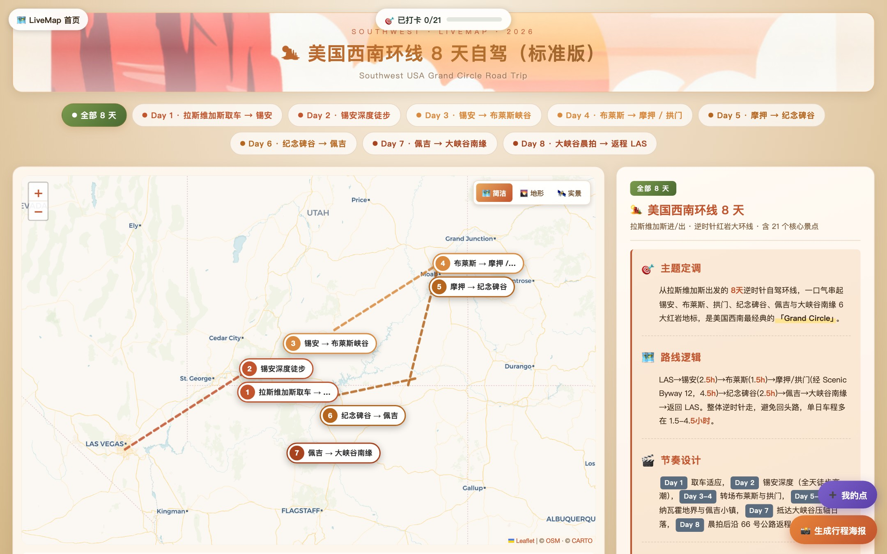
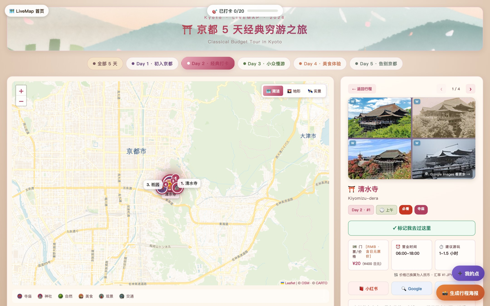
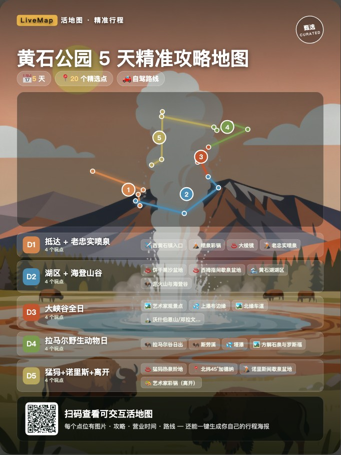

<div align="center">

# 🗺️ Itinera · 旅行地图

### 跟着这本地图，打开你的旅行。

一次旅行，收进一个可以随身带走的文件。真实的地图上，每天一种颜色；
每一处停留，都写着它值得停的理由。

出发前它是期待，路上它是不用信号也能翻开的一页，
回来以后，它是你走过哪里的记号。

[**▶ 浏览 32 条行程**](https://shixiann25.github.io/itinera/) · [**✨ 自己生成一张**](https://livemap-b1im.onrender.com/) · [**🗺️ 装成 Claude Skill**](https://github.com/shixiann25/itinera-skill) · [PRD](PRD_Itinera.md) · [部署](DEPLOY.md)

<sub>*Follow this map, and let the trip unfold. A whole journey, folded into a single file you can
carry anywhere — a real map, a colour for each day, and beside every stop, the reason it's worth
stopping. Before you leave it's anticipation; on the road it's the page that opens without a
signal; when you're home it's a record of where you've been.*</sub>

<sub>~110 KB · one HTML file · works offline · vanilla JS + Leaflet + an LLM that writes the POI data · UI in Chinese or English</sub>


</div>

---

## 这是什么

旅行攻略的通病是**信息量足够，结构为零**：小红书散、马蜂窝长、ChatGPT 给你一堵文字墙、Google My Maps 长得像工程师的调试界面。而真正要用攻略的人——被你拉着一起去的爸妈、对象、朋友——**根本不看字**。

Itinera 换了个思路：**不做更全的攻略，做一眼就懂的攻略**。

一个目的地 + 天数 + 偏好，输出一个 **单文件 HTML**：真实地理底图上标好每天的路线、每个点的门票和营业时间、去哪拍照、吃什么。文件只有 ~110 KB，微信能发、AirDrop 能传、断网也能看。

目前仓库里有 **32 条做好的行程、560+ 个景点**，覆盖美国国家公园、日本、韩国、泰国、西班牙、九寨沟等。

## 长什么样

| 全程总览 | 单日 + 景点详情 |
|---|---|
|  |  |
| 每天一种颜色的路线、日签标注、一屏看完整个行程 | 四宫格实拍、门票（原币 + 人民币）、营业时间、建议游玩时长、拍照点、美食 |

<table>
<tr>
<td width="58%"></td>
<td width="42%"></td>
</tr>
<tr>
<td>Hub 画廊：每张卡片配一张为它单独生成的 AI 明信片</td>
<td>一键生成行程海报（含二维码），这是产品的增长回路</td>
</tr>
</table>

## 功能

**地图本体**
- Leaflet 真实底图（简洁 / 地形 / 实景三套切换），POI 带编号与分类配色
- 每日路线分色连线，点与点之间标注距离和车程（按路程分级估算，不是直线距离）
- 标签防重叠引擎：常驻名称 + 碰撞消解 + 智能隐藏，**验收标准是重叠 0、超界 0**，由 `tools/audit_maps.mjs` 真实渲染校验
- 移动端单列布局 + Day Tab 横向滚动

**景点详情**
- 四宫格实拍图（Wikipedia + Wikimedia Commons 多源搜图）+ 全屏 Lightbox + 键盘翻页
- 门票价格自动换算人民币（JPY / USD / EUR / GBP / KRW / THB / AUD / CAD）
- 营业时间、建议游玩时长、拍照点、美食推荐（每条可直接跳 Google Maps）、避雷提醒
- 一键跳转小红书 / Google 查攻略

**行程层**
- 结构化行程解读（主题定调 / 节奏递进 / 路线设计 / 实用建议），关键词自动高亮
- 推荐酒店、雨天 Plan B、出行前必看（签证 / 电压 / SIM / 汇率 / 小费 / 急救）
- GPX 导出（导进 Google My Maps 或 Garmin）
- 打卡 checklist + 自定义地点（localStorage，带地理编码搜索）
- **行程海报**：AI 明信片底图 + 行程摘要 + 二维码，一键出图分享

**四种出行模式**——同一目的地按 J 人精算 / P 人随性 / 中产舒适 / 穷游省钱生成不同版本，消费、节奏、酒店、餐厅、交通全都不一样。

## 技术选择与取舍

这个项目有几个刻意的「反直觉」决定，都是为了守住「**单文件、能发出去、打开就能看**」这条产品底线：

| 决定 | 为什么 |
|---|---|
| **不用 React / Vue，纯 vanilla JS** | 产物必须是一个能微信发送的 HTML 文件。上框架就得上构建产物和运行时，文件立刻胖一圈，还不能直接双击打开 |
| **不用 Mapbox，用 CartoDB 免费瓦片** | Mapbox 要 API key，key 进了单文件就等于公开。免费瓦片够用，且不给分享出去的文件留后门 |
| **地图是「生成的产物」而不是「渲染的应用」** | POI JSON → 模板占位符替换 → 静态 HTML。没有运行时数据请求，断网也能看 |
| **AI 明信片而不是搜来的照片** | 维基是全文搜索，词不沾边也一定还你一个「最相关」条目——真实翻车案例见下。每张地图配一张专门生成的插画，切题、风格统一、不看搜索脸色 |
| **分享卡标签只注入 `dist/`，不写进源文件** | `og:image` 必须是绝对 URL。写进 `maps/*.html` 就把这个文件绑死在某个域名上了，而它本该能离线传播 |

### 两个值得记的坑

**1. 上游一个查询参数，让全站配图静默失效。**
Wikimedia 给缩略图 URL 挂上了 `?utm_source=…&utm_campaign=parser`，而配图过滤器用 `/\.(jpg|jpeg|png)$/` 判扩展名——要求 URL **以** `.jpg` 结尾。挂了 query 之后一张都过不了，32 张地图的四宫格全部静默回退成 emoji，没有任何报错。判扩展名前先 `split(/[?#]/)[0]` 就修好了。教训：**对外部 URL 做正则匹配，永远先剥掉 query。**

**2. 全文搜索永远有结果，不代表结果对。**
页头大图原本拿 `META.subtitle`（市场话术）当搜索词，于是 `"Classical Budget Tour in Kyoto"` 搜出了 **Taiwan**，`"SOUTHWEST"` 搜出了一篇讲**陶器**的条目，美国西南自驾的页头一度挂着 **Sheldon Adelson 的人像照**。现在的做法是三道防线：① 优先用本地 AI 明信片；② 搜索词只用具体地名；③ 命中条目的标题必须和查询词共享实词，否则宁可不出图。

**3. 别用 MutationObserver 监听 body 子树。**
会和 Day Tab 切换时的 innerHTML 重渲染打架，历史上连续三次升级都栽在这。要改行为就直接 patch 源码，或者 override 函数。

### 单文件的代价

每张 `maps/*.html` 都是自包含的，好处是能离线分享，代价是**模板里修的 bug 不会自动流到已生成的 32 张图上**。所以有 `generator/patch_maps.py`：一个补丁登记处，每条补丁声明「旧写法 → 新写法 + 幂等标记」，一条命令回填全部成品，`--check` 模式给 CI 当质量门。上面那三个坑就是这么修的。

## 架构

```
                   ┌─────────────────────────────────────┐
  "北海道 5 天"  →  │  generate.py                        │
  偏好 / 模式       │  LLM（豆包 / Claude）→ POI JSON     │
                   │  → template.html 占位符替换          │
                   └──────────────┬──────────────────────┘
                                  ↓
                       maps/hokkaido_5d.html
                     单文件 · ~110 KB · 离线可看
                                  ↓
        ┌─────────────────────────┴──────────────────────┐
        ↓                                                ↓
  build_static.py                                   server.py
  → dist/（注入画廊列表 + 分享卡标签）              → 本地/Render 在线生成
  → GitHub Pages                                    → 可视化编辑器
```

**运行时依赖**（都是免运维的免费服务）：CartoDB 瓦片、Wikipedia / Wikimedia Commons 搜图、OSM Nominatim 地理编码、Google Maps 深链。

## 跑起来

```bash
git clone https://github.com/shixiann25/itinera.git && cd livemap
python3 generator/build_static.py --out dist
cd dist && python3 -m http.server 8000     # 打开 http://localhost:8000
```

只看地图不需要任何依赖和密钥。**要用 AI 生成新地图**才需要配 key：

```bash
cp generator/.env.example generator/.env    # 填 VOLC_API_KEY（火山方舟，豆包语言模型）
python3 generator/server.py                 # http://localhost:5005 首页输入框可直接生成
```

命令行生成：

```bash
python3 generator/generate.py "拉森火山国家公园" 3 --pref "从 SJC 出发自驾往返" --slug lassen_volcanic
python3 generator/gen_postcard.py "Lassen Volcanic" assets/postcards/lassen_volcanic_3d.png
node tools/gen_og_cards.mjs                 # 补分享卡（幂等，只补缺的）
```

## 也可以当 Claude Code skill 用

同一套模板，另一种用法：装成 skill 之后，**行程数据由 Claude 直接写**，不需要任何 API key、
不需要后端、不花钱——而且可以对话式改（「第 3 天太赶了，拆成两天」）。

### 安装

skill 单独发在 **[shixiann25/itinera-skill](https://github.com/shixiann25/itinera-skill)**，
在 Claude Code 里两条命令：

```
/plugin marketplace add shixiann25/itinera-skill
/plugin install livemap@livemap
```

不需要 API key、不需要 pip 装包——只要有 `python3`。
装完对 Claude 说「帮我做个京都 6 天的旅行地图」就行。

### 在本仓库开发

skill 的**源**在这里（模板、数据契约都在主仓库），独立仓库只是构建产物：

```bash
python3 skill/build_skill.py --install    # 装到 ~/.claude/skills/itinera/，改完即时生效
python3 skill/build_skill.py --publish    # 同步进 ~/itinera-skill，再自己 commit/push
```

```
skill/
├── build_skill.py        从主仓库派生 skill 包（模板内联依赖 / 规格从 CLAUDE_PROMPT 提取）
└── livemap/              构建产物，--publish 同步到独立仓库
    ├── SKILL.md          工作流
    ├── reference/        数据契约 + 真实样例
    └── scripts/          render.py（JSON→HTML，带校验）· extract.py（HTML→JSON，用于改图）
```

skill 包是**从主仓库自动派生的**，不是手抄的副本：`template.html` 会把
`lm_checkin.js` 内联进去、去掉需要后端的编辑器，保证产物是真单文件；
`reference/schema.md` 直接从 `generator/generate.py` 的 `CLAUDE_PROMPT` 提取。
CI 会跑 `--check` 拦住「主仓库改了但 skill 包没重建」。

## 改完必须跑的 QA

改了地图 UI / 模板，**一定要跑真实渲染审计**——这个项目最容易坏的就是标签重叠和溢出，肉眼在一两张图上看不出来：

```bash
npm install && npx playwright install chromium
python3 generator/build_static.py --out dist
python3 -m http.server 8000 --directory dist &

python3 generator/patch_maps.py --check       # 32 张成品是否跟上了模板改动
python3 skill/build_skill.py --check          # skill 包是否跟上了主仓库
node tools/audit_maps.mjs                     # 验收：重叠 0 · 超界 0 · 错误 0（非 0 退出即失败）
node tools/test_poster.mjs                    # 海报功能 E2E
node tools/shot_maps.mjs                      # 用户视角截图 → /tmp/livemap_qa/
```

CI（`.github/workflows/`）会在每次 push 时跑同一套检查，然后自动构建并发布到 GitHub Pages。

## 目录

| 路径 | 作用 |
|---|---|
| `index.html` | Hub 落地页（输入框 + 画廊） |
| `maps/*.html` | 32 张成品单文件地图 |
| `generator/template.html` | 地图模板（占位符），新图由它渲染 |
| `generator/generate.py` | 目的地 → LLM → POI JSON → HTML |
| `generator/build_static.py` | 打包 `dist/`，注入画廊列表与分享卡标签 |
| `generator/patch_maps.py` | 给 32 张成品批量回填模板改动（幂等） |
| `generator/server.py` | 本地 / Render 后端：在线生成 + 编辑器保存 |
| `assets/postcards/*.png` | 每张地图的 AI 明信片（页头底图 / 卡片配图 / 海报底） |
| `assets/og/*.jpg` | 每张地图的社交分享卡（1200×630） |
| `assets/lm_checkin.js` `assets/lm_editor.js` | 打卡 checklist / 可视化编辑器 |
| `tools/*.mjs` | Playwright 工具：渲染审计、截图、海报 E2E、分享卡生成 |

## 已知限制

- **两个线上入口用途不同。** GitHub Pages 是秒开的只读镜像，生成按钮会降级成说明；能真生成的是 Render 那个（免费档闲置会休眠，冷启动要等 50 秒以上）。
- **生成慢，且随天数线性增长。** 实测约每个景点 15 秒：1 天 60 秒，5 天 3 分半，8 天要五六分钟。走流式传输，否则连接会被负载均衡掐掉。
- **访客新生成的地图会在后台自动补一张 AI 明信片**（约 ¥0.2/张，不增加等待）；补图失败时页头回退到维基搜图。`AUTO_POSTCARD=0` 可关。
- **生成结果不持久。** 现在存本地文件系统，Render 免费档重启即丢。要真正跑通「生成 → 短链 → 分享」还缺对象存储和短链服务。
- **单图 98–120 KB**，超出了 PRD 自己定的 100 KB 目标，主要是内联的模板逻辑。
- **POI 由 LLM 生成**，坐标和营业信息可能有误，目前靠人工抽检，没有自动校正。

## Roadmap

- [x] ~~部署常驻后端 + 每日生成额度（防刷）~~ —— 已上线，首页生成按钮可用
- [ ] 生成加速：现在约每个景点 15 秒，8 天行程要五六分钟。可以按天并行拆分请求
- [ ] 短链 + 生成结果持久化，跑通 PRD 里的完整分享回路
- [ ] 把 `audit_maps.mjs` 的验收范围扩到移动端视口
- [ ] 单图瘦身到 100 KB 以内

---

<div align="center">
<sub>Vanilla JS · Leaflet · Python stdlib · Playwright · 零框架 · 零构建产物</sub>
</div>
